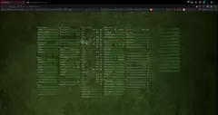

# TabPage
A code copy of my browser tab page.

[](.github/media/tabpage.webp)

I've created my on tab page with often used links because i'm not fan of tab pages from current browsers.

*Oh and this version does not contains all of my links.* :-P

## Requirements?!
Some browsers no longer support loading additional files like javascript from `file://` scope. I am using apache2 as local http server but any other lightweight http server should also work.

### Alternative
index_webSrvLess.html - This working standalone but all data (javascript and json) must be inside the html file.

## json file structure

```json
[
	{
		"title":"Group title1",
		"info":"Some text",
		"entries":[
			"<link_url>",
			"<link_url>|<linklabel>",
			"<link_url>|<linklabel>^<link_url>|<linklabel>",
			["<link_url>|<linklabel>","<link_url>|<linklabel>"]
		]
	},
	true,
	{
		"title":"Group title1",
		"entries":[
		]
	}
]
```

### Columns and rows
> The groups flowing in columns and **true** break it to create the next group in next row.

### entries
> You have multible options.
1. link only `"https://example.com"`
2. link with label `"https://example.com|Example"`
3. multible links in one line (version 1) `"https://example.com^https://example.com"`
4. multible links in one line (version 2) `["https://example.com","https:example.com"]`
5. Text without link `Something` ;-)

> In links.json are visible example with 4. and 5. in combination.

> `info` entry is a little subtitle.

## search file structure

```json
[
	["<label>","https://www.google.com/?q=","red"]
]
```

> The text from input field will be append on url. For most page it is required to have an argument like `?q=` or `?search=`.

> The hast entry `"red"` is optional. It is for background color on focus input field.
